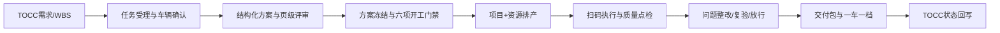

# 吉利试制样车改制数字化平台 产品需求文档（PRD）

> 最后更新：2026-07-18｜版本：0.1 汇报演示版

## 一、项目概述

### 1.1 项目愿景

以车辆唯一身份为主线，把需求、方案版本、资源排产、物料齐套、现场证据、质量结论和交付档案串成可监管、可追溯、可分析的改制业务闭环。

### 1.2 目标用户

| 角色 | 核心职责 | 汇报版核心诉求 |
|------|----------|----------------|
| 试制策划经理 | 需求受理、方案组织、项目推进 | 看项目全局、方案状态和交付风险 |
| 工艺工程师 | 工艺方案、作业文件、现场支持 | 版本冻结、工位精准查阅 |
| 生产平衡工程师 | 计划排产、资源协调、插单处理 | 举升机/工位冲突可视化 |
| 质量工程师 | 质量策划、检验、问题闭环 | 未关闭问题阻断交付 |
| 改制技师 | 现场拆改装调、扫码、报工 | 当前任务、冻结文件、扫码点检 |
| 物料管理专员 | 齐套、配送、拆车件暂存 | 缺料原因和拆换件去向透明 |
| 管理层 | 经营与交付决策 | 进度、风险、资源、质量统一看板 |

### 1.3 核心业务流程

## 二、功能清单

### 状态说明

- 🔴 待开发｜🟡 开发中｜🟢 已完成｜⚫ 已废弃

| ID | 模块 | 汇报版功能 | 状态 | 优先级 | 对应代码 |
|----|------|------------|------|--------|----------|
| F001 | 管理驾驶舱 | KPI、风险、资源占用、项目进度 | 🟢 | P0 | `src/app/(platform)/dashboard` |
| F002 | 项目任务 | 任务台账、项目详情、车辆和阶段进度 | 🟢 | P0 | `src/app/(platform)/projects` |
| F003 | 方案评审 | 版本、页级意见、评审通过率、冻结动作 | 🟢 | P0 | `src/app/(platform)/review` |
| F004 | 计划排产 | 举升机 AM/PM/EV 调度、冲突和插单影响 | 🟢 | P0 | `src/app/(platform)/schedule` |
| F005 | 物料齐套 | 四类物料齐套、缺料风险、拆车件容器 | 🟢 | P0 | `src/app/(platform)/materials` |
| F006 | 数字工位 | 开工门禁、冻结文件、扫码拆换件、报工 | 🟢 | P0 | `src/app/(platform)/workshop` |
| F007 | 质量闭环 | 问题分类、责任、整改、复验、横展、放行 | 🟢 | P0 | `src/app/(platform)/quality` |
| F008 | 一车一档 | 车辆履历、方案/物料/质量/交付证据 | 🟢 | P0 | `src/app/(platform)/vehicles/[id]` |
| F009 | 集成中心 | TOCC/SAP/LES 接口状态与失败重试展示 | 🟢 | P1 | `src/app/(platform)/integrations` |
| F010 | 用户认证与权限 | NextAuth、角色和数据权限 | 🔴 | P1 | 待客户确认组织与 SSO |
| F011 | 真实数据库 | Prisma + MySQL 持久化 | 🔴 | P1 | 演示版使用一致性静态数据 |
| F012 | 在线 PPT 编辑 | 结构化章节、自由贴图、页级标注 | 🔴 | P2 | 本版展示评审对象模型，不做编辑器 |

## 三、汇报演示验收标准

- [ ] 从驾驶舱可进入同一项目和车辆，所有页面数据口径一致。
- [ ] 可看到方案 V3 评审进度、未关闭意见和冻结规则。
- [ ] 可看到六项开工门禁及物料/质量阻断原因。
- [ ] 可展示三区域举升机 AM/PM/EV 排程与资源冲突。
- [ ] 可模拟扫码装件、质量点检和阶段报工反馈。
- [ ] 可演示质量问题从提出到复验关闭的状态变化。
- [ ] 一车一档可回放需求、方案、执行、物料、质量和交付证据。
- [ ] TOCC、SAP、LES 的接口职责和同步状态清晰可见。
- [ ] 375px、768px、1024px、1440px 无横向溢出或遮挡。

## 四、数据模型概览

| 实体 | 说明 | 关键关系 |
|------|------|----------|
| RetrofitProject | 改制项目/WBS | 一对多车辆、任务、方案版本 |
| Vehicle | 车辆唯一身份 | VIN/样车号/TOCC ID，聚合一车一档 |
| RetrofitTask | 车辆级改制任务 | 阶段、计划、车间、工位、责任班组 |
| SolutionVersion | 结构化改制方案版本 | 页级评审意见、冻结状态 |
| ScheduleSlot | 排产资源槽 | 车间、举升机、班次、冲突 |
| MaterialRequirement | 物料需求 | 标准件/调拨件/新开件/拆车件、齐套状态 |
| PartTraceEvent | 拆装件追溯事件 | 来源车、目标车、件码、箱码、动作 |
| QualityIssue | 质量问题 | 分类、责任、整改、复验、横展、放行 |
| DeliveryPackage | 交付包 | 文件、质量证据、实物追溯、回写状态 |
| IntegrationLog | 外部接口日志 | TOCC/SAP/LES 请求、结果、重试 |

## 五、技术决策

- 汇报演示版参考 LIMS-Next：Next.js 15 App Router + React 18 + TypeScript + Ant Design 5。
- 目标数据层采用 Prisma + MySQL；当前版先使用前端一致性演示数据，降低下周汇报风险。
- 招标技术要求书提出 Vue 3 + Spring Boot 3.5。**已确认（2026-07-21）技术栈为可协商条款，允许等价技术栈**，故当前 Next.js 全栈架构作为正式交付基础继续演进，仅需在合同中书面固化该约定。

## 六、变更历史

| 日期 | 版本 | 变更内容 |
|------|------|----------|
| 2026-07-18 | 0.1 | 基于 V15 招标书、V13 方案和原始调研材料建立汇报演示范围 |
